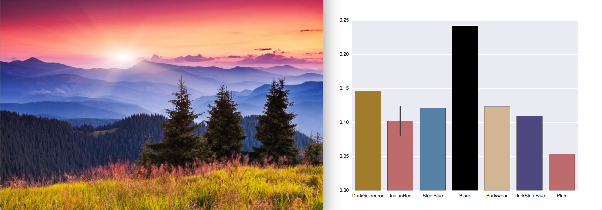

#Color-visual

Creates a [Seaborn](https://stanford.edu/~mwaskom/software/seaborn/) barplot of the color components in an image as found by the [Clarifai color API](https://developer.clarifai.com/guide/color#color). Each bar in the barplot is of the color labeled on the x-axis. The y-axis indicates color density in the image.

##How to
1. Create an account at [developer.clarifai.com](https://developer.clarifai.com/).

2. Set your `CLARIFAI_APP_ID` and `CLARIFAI_APP_SECRET` as environment variables by entering the following in your command line
	```
	export CLARIFAI_APP_ID = 'your ID here';
	export CLARIFAI_APP_SECRET = 'your secret here';
	```

	You can verify that these variables are set with
	```
	echo $CLARIFAI_APP_ID $CLARIFAI_APP_SECRET
	```

3. From the command line, run
	```
	python main.py <your image url here>
	```

4. The command line will print the name of the colors found, their hex values and their density in the image. The script will also open a seaborn plot.

##Example

This is the barplot for the image (https://c.tadst.com/gfx/750w/sunrise-sunset-sun-calculator.jpg?1)

##Dependencies
* python 2.7.11
* seaborn 0.7.1
* matplotlib 1.5.1
* clarifai python client [(more here)](https://github.com/clarifai/clarifai-python)
